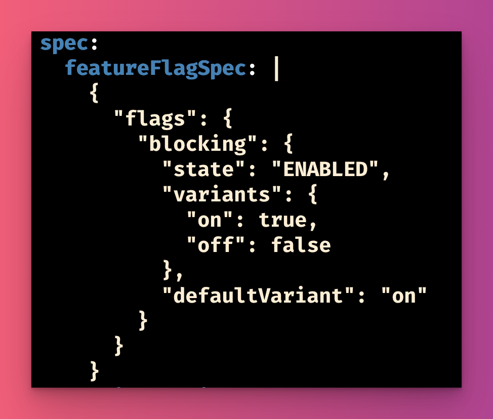

# watchman

A general purpose admission controller that uses open-feature to control it's capabilities.

This is a demonstration project that is designed to familiarise the user with how open-feature can be used within Kubernetes to control infrastructure. 

This project demonstrates:

- [open-feature golang SDK](https://github.com/open-feature/golang-sdk)
- [flagD](https://github.com/open-feature/flagd)
- [open-feature operator](https://github.com/open-feature/open-feature-operator)

_But how does it work?_

## Run the demo

- Setup a Kubernetes cluster
- Install open-feature-operator as described [here](https://github.com/open-feature/open-feature-operator#deploy-the-latest-release)
- `kubectl create namespace watchman-system`
- `kubectl create -f config/samples/flags.yaml`
- `kubectl create -f config/webhook/certificate.yaml`
- `IMG=cnskunkworks/watchman:0.0.1 make deploy`

You should see that you have watchman injected with flagd.

This now means you can turn on or off pod admission with the watchman `FeatureFlagConfiguration` custom resource named `watchman-flags/watchman-system`

